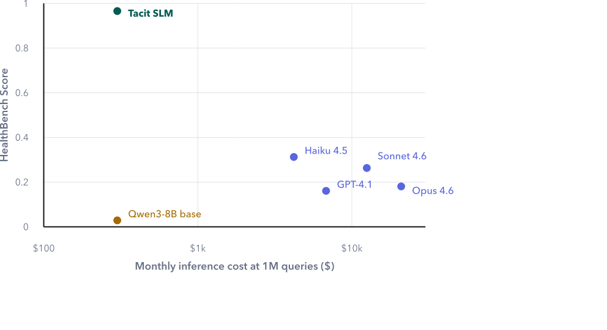
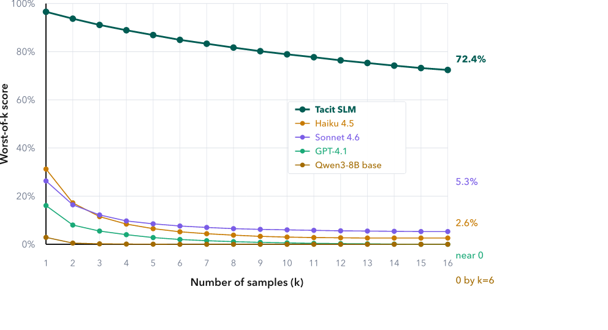
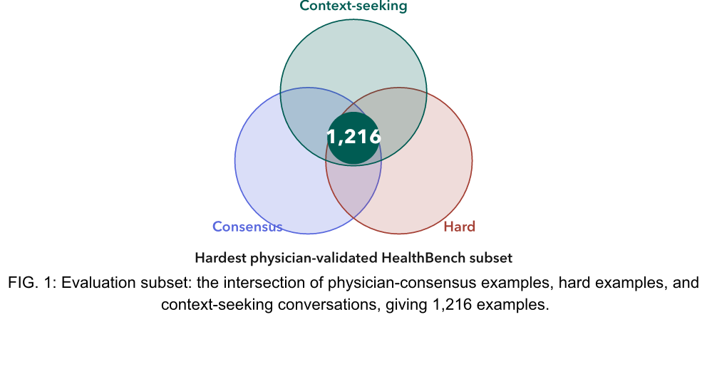
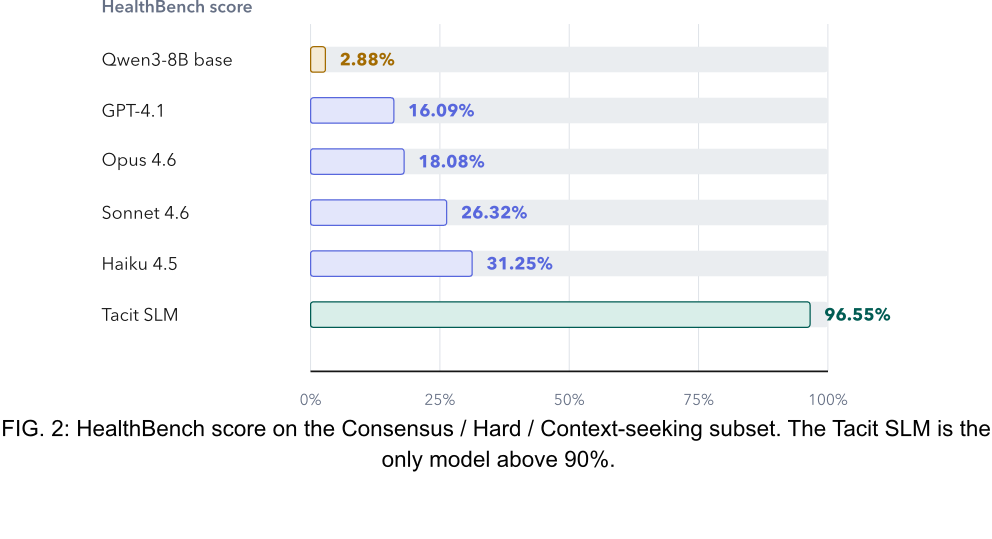
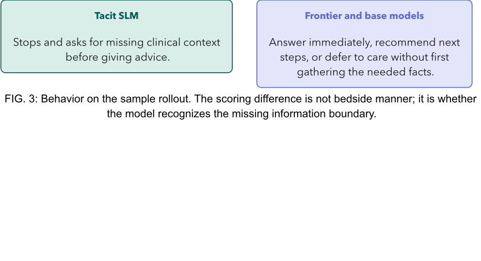

**Field Note / Health AI**

# A Specialised Language Model Beats Frontier Models on HealthBench

## Executive Summary

**An 8B-parameter model, trained with reinforcement learning in just over one day on a single GPU, scores 96.55% on the hardest physician-validated subset of HealthBench.** GPT-4.1 scores 16%, Opus 4.6 scores 18%, and Sonnet 4.6 scores 26%.

**This report presents a methodology result where reinforcement learning with verifiable rewards, applied to a small open-weight model using only public training data, produces a system that outperforms the best commercial foundation models on the hardest clinical AI benchmark available.** Our proof-of-concept uses Qwen3-8B as the base model. Total training time: just over one day on a single L40S GPU.

**The base model scores 2.88%; our model scores 96.55%.** At one million queries per month, our inference bill is roughly $300, compared with roughly $12,500 for Sonnet 4.6 and $20,900 for Opus 4.6.

**Reliability is equally striking.** If we generate 16 independent responses to the same prompt and score the model by its worst answer, our model still holds 72.4%. Haiku 4.5 drops to 2.6%. Sonnet 4.6 drops to 5.3%. GPT-4.1 drops to near zero.

**This is proof that focused small models, trained with the right representative dataset, deliver better accuracy, better reliability, and better inference cost than general-purpose frontier foundation models.** The important claim is not that small models are always better. The claim is that a Specialised Language Model, trained for the right behavior on the right task, can outperform larger general-purpose systems in the setting where the product actually needs to work.

**Most health AI benchmarks use multiple-choice questions.** Frontier models have already saturated them. More importantly, multiple-choice does not reflect how AI is actually used in real-world settings.

**HealthBench is different.** Built by OpenAI with 262 physicians from 60 countries, it contains 5,000 realistic multi-turn health conversations scored against 48,562 physician-written rubric criteria. The model must generate open-ended responses, and those responses are graded on whether they include the right facts, communicate clearly, and give safe guidance.

**We deliberately chose the hardest, most rigorously validated subset of HealthBench: the intersection of Consensus, Hard, and Context-Seeking examples.** Consensus means multiple physicians independently agreed on the grading criteria. This removes annotation noise and makes the evaluation closer to expert clinical judgement, not the preference of a single annotator.

**Hard avoids easy questions that inflate scores.** Context-Seeking tests whether a model knows when to stop and ask follow-up questions instead of guessing. That is clinically important because the right response often depends on missing information. In a real clinical or enterprise workflow, a model that answers confidently before it has the necessary facts can look helpful while behaving badly.

**Our proof-of-concept uses Qwen3-8B as the base model.** The training data comes entirely from public sources: Reddit r/AskDocs, Mayo Clinic Q&A, and other datasets on Hugging Face. We use only the questions and generate synthetic training data using Anthropic's Claude Haiku 4.5 models. There are 1,046 examples in the training dataset.

**Training happens in two stages.** First, 8 steps of supervised fine-tuning so the model learns the right clinical terminology and response format. Then RLVR, or reinforcement learning with verifiable rewards, using GRPO for one epoch. The reward function checks whether the model correctly spots missing clinical context and asks the right follow-up questions.

**The base Qwen3-8B model scores 2.88%; our model scores 96.55%, while the best commercial API scores 31.25%.** The entire gain comes from the training process.

**Why do commercial models struggle here?** Context-seeking requires the model to stop and ask questions instead of answering right away. General-purpose models are trained to be helpful, which biases them toward giving a response immediately, even when key clinical information is missing.

**A notable inversion in the results: more capable models score lower than less capable ones.** Opus 4.6 scores below Haiku 4.5, despite being Anthropic's most powerful model. From our analysis, larger models are more confident and more eager to provide comprehensive answers. The very capability that makes them impressive on general benchmarks works against them here, where the correct behavior is to say, "I need more information."

**The sample rollout makes this visible.** In a HealthBench conversation about chest pain, fatigue, shortness of breath, stress, and a user pushing for a quick fix, only our model scores 100%; every commercial model scores 0%. The difference is clear: our model asks clarifying questions before giving advice, while every other model jumps straight to recommendations or defers to "see a doctor" without first gathering the information needed to assess the situation.

**Our model runs on the same base architecture as Qwen3-8B.** The inference cost is identical: $0.05 per million input tokens and $0.40 per million output tokens. The RLVR training adds capability without adding cost. A model that demos well but has a fast-collapsing worst-of-k curve is fragile in production, especially in agentic systems with retries, branches, or multiple tool calls.

**Clinical AI does not require frontier-scale models or frontier-scale budgets.** A small model, trained with the right objective, can outperform systems that cost billions to build and two orders of magnitude more to run.

**This is the role of the Specialised Language Model: not a general-purpose model made smaller, but a model trained to do the specific thing the domain needs.** For healthcare, that means better accuracy, better reliability, and better inference cost. For enterprises and government agencies, it means building AI systems that can be governed, improved, and deployed at the scale real workflows require.

**To learn more about what a Specialised Language Model could do inside your organisation, agency, or regulated domain, get in touch.**
